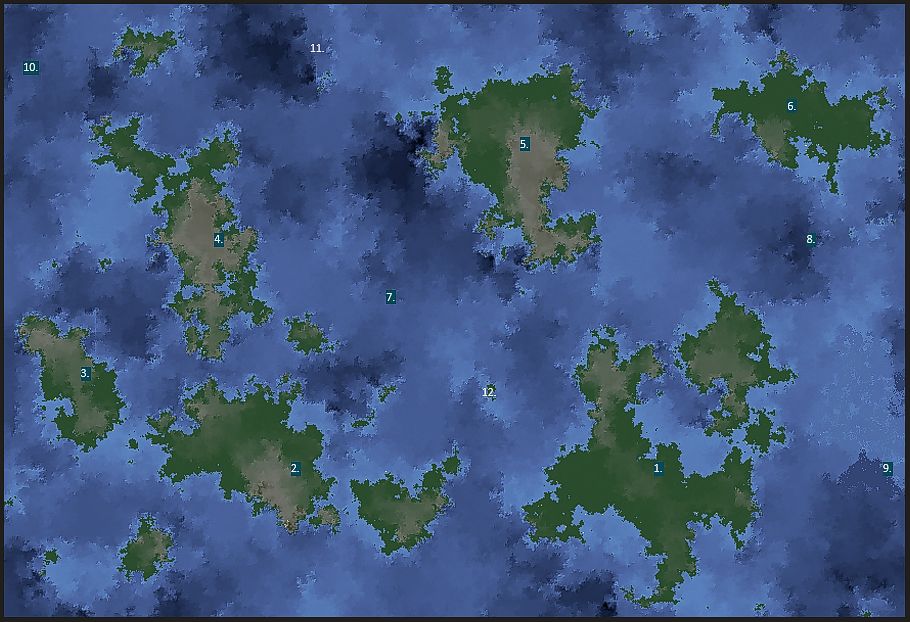
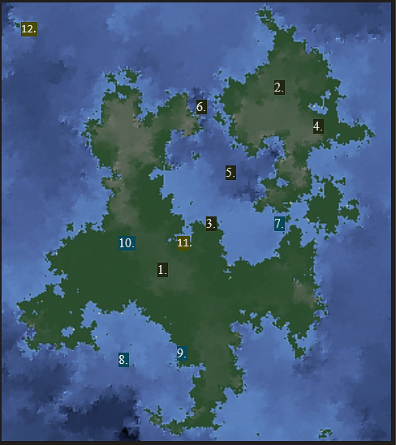
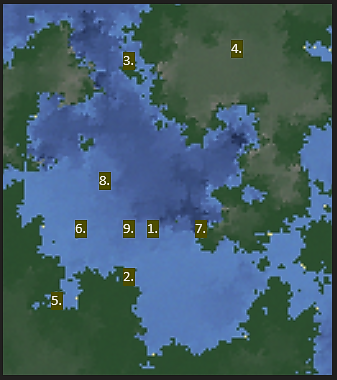

# Maps
[Table of Contents][TC]|[Previous page][L]|[Next page][N]

>The world of Tallahs, created by Selune and Shar, has thrived with life and civilization for eons. The myriad continents are filled with a variety of races and monsters. The Southern Pole is Southeast of Di'oa, and the Northern Northwest of Jiorhaven. The Equator runs from the Southwestern corner of the world, to the Northeastern.
## Tallahs

### **Legend**
1. Di'oa
2. Draconia
3. Bantear
4. Jiorhaven
5. Chungusheim
6. Vantorm
7. Lucidian Ocean
8. Pentari Ocean
9. Frozen Straight
10. Barren Ice Cap
11. Tranquil Sea
12. Broken Tooth Anchorage

---------------------------------------------------------------------------------------------------------------------------------------------------------------------------------

### Di'oa

#### **Legend**
1. Di'oa Empire
2. Dra'vore
3. Serenis
4. Ekron
5. Vestigial Sea
6. Great Northern Falls of Berrea
7. Great Southern Falls of Midrak
8. Gulf of Twilher
9. Bona
10. Caldwell
11. Emerde Wetlands/Queens Breech
12. Tomb of Asmodeus

---------------------------------------------------------------------------------------------------------------------------------------------------------------------------------

#### Vestigial Sea

##### **Legend**
1. Temple of Sekolah/Fort Ceran
2. Serenis
3. Barrea
4. Dra'vore
5. Queens Breech
6. Seameet
7. Corrinthia
8. Vesrah _(Water Ashari)_
9. Sea Elf Village

---------------------------------------------------------------------------------------------------------------------------------------------------------------------------------
#### Serenis

[TC]: README.md "Table of Contents"
[L]: Lore.md "Lore"
[N]: NPCs.md "NPCs"
