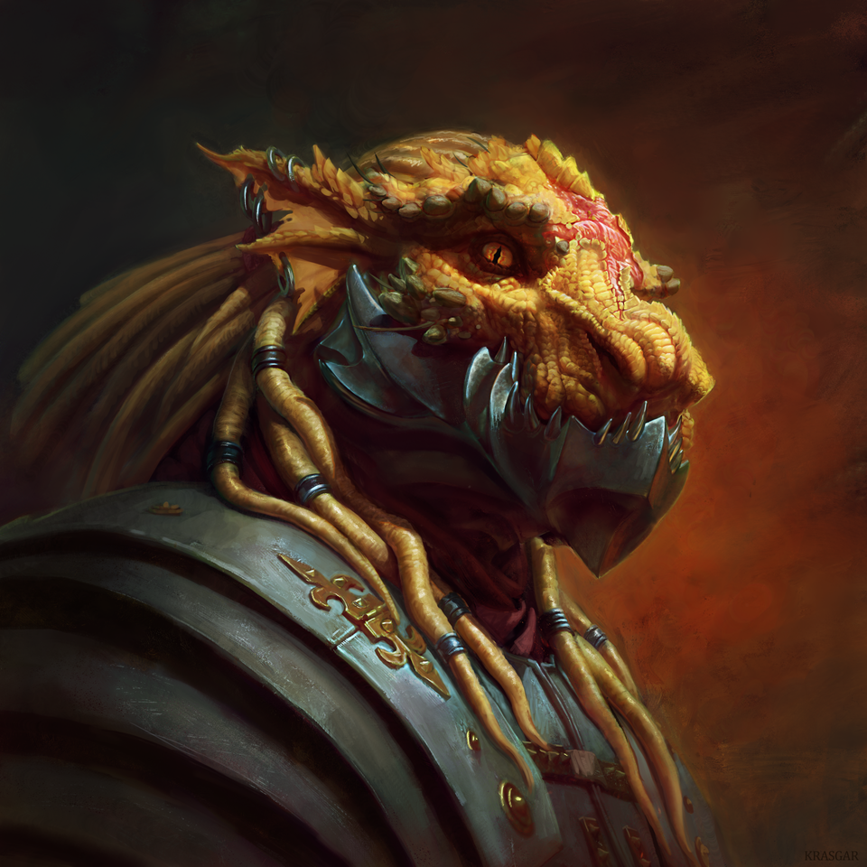

# Non-Player Characters
[Table of Contents][TC]|[Previous page][M]|[Next page][P]

## **Lawful Good**
- Oban Stodof
- Jerimiah Grayfeild _(dead)_
- Kathyra Arac
- Yoril

## **Neutral Good**
- Adra Kettil
- Ovar Kettil
- Jon Grays
- Glim Remesk
- Teth

## **Chaotic Neutral**
- Christopher Framden
- Reo Elfhide
- Iapar Hectar
- Tix

## **Lawful Neutral**
- Vegril Katsk
- Brockham Dusklance

## **True Neutral**
- Algar Dyomin

## **Chaotic Evil**
- Zhahalu
- Caedogeist
- Fossous Hornthane _(dead)_

## **Lawful Evil**
- Rader Nivrev

---------------------------------------------------------------------------------------------------------------------------------------------------------------------------------

## **Character Details**
---------------------------------------------------------------------------------------------------------------------------------------------------------------------------------
### Iapar Hectar
>Iapar is a Merchant/Ambassador in Queens Breech. He hails from Draconia and uses The Emerde Wetlands to smuggle illegal goods to and from Draconia. He is a red dragonborn adorned with many pieces of jewelry.

### Fossous Hornthane _(dead)_
>Fossous is an elderly dwarf who worked as a stone mason his whole life.
>He is a member of The Cult of The Betrayers, but because he is the choosen champion of Tharizdun, The Mad God, he has gone insane from hs worship. He still works for the Cult but has been convinced he works for some kind of inventors club, making arcane machines for Rader Nivrev.
>His most recent success was creating a device to cause localized plane shifts, causing a normal stone gargoyle to come to life after channeling the elemental Plane of Earth.

#### Appearance
>He is short, even for a dwarf, fat and old. His once long beard now is gray and unkept, burned away in patches. You can see soot smudged all around his face and a heavy smell of booze and gunpowder radiates from him.

#### Abilities
>He has high INT, and low WIS, and CHA.
>His skills revolve around his masterful skill in transmutation magic and enchanting.

#### Quest Related Items
- Rader's Sending Stone
- Fossous' Spellbook
- Planar Energy Focus Prototypes

[TC]: README.md "Table of Contents"
[M]: Maps.md "Maps"
[P]: PCs.md "PCs"
